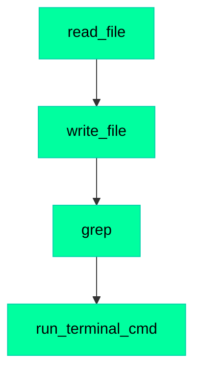

# Example Exported Session - Process Flow

**Session**: 2026-01-01 14:32:15

**Total Actions**: 4

## Action Flow



## Action Details

### 1. read_file

- **Status**: [success] Success
- **Time**: 14:32:18
- **Arguments**:

```json
{
  "target_file": "/Users/inventure71/VSProjects/GenGame/test.py",
  "offset": 0,
  "limit": 100
}
```

- **Result**:

```
     1|def hello():
     2|    print('Hello, World!')
     3|
```

---

### 2. write_file

- **Status**: [success] Success
- **Time**: 14:32:22
- **Arguments**:

```json
{
  "file_path": "/Users/inventure71/VSProjects/GenGame/test.py",
  "contents": "def hello(name='World'):\n    print(f'Hello, {name}!')\n"
}
```

- **Result**:

```
File written successfully
```

---

### 3. grep

- **Status**: [success] Success
- **Time**: 14:32:25
- **Arguments**:

```json
{
  "pattern": "def hello",
  "path": "/Users/inventure71/VSProjects/GenGame"
}
```

- **Result**:

```
test.py:1:def hello(name='World'):
```

---

### 4. run_terminal_cmd

- **Status**: [success] Success
- **Time**: 14:32:28
- **Arguments**:

```json
{
  "command": "python test.py",
  "is_background": false
}
```

- **Result**:

```
Hello, World!
```

---

